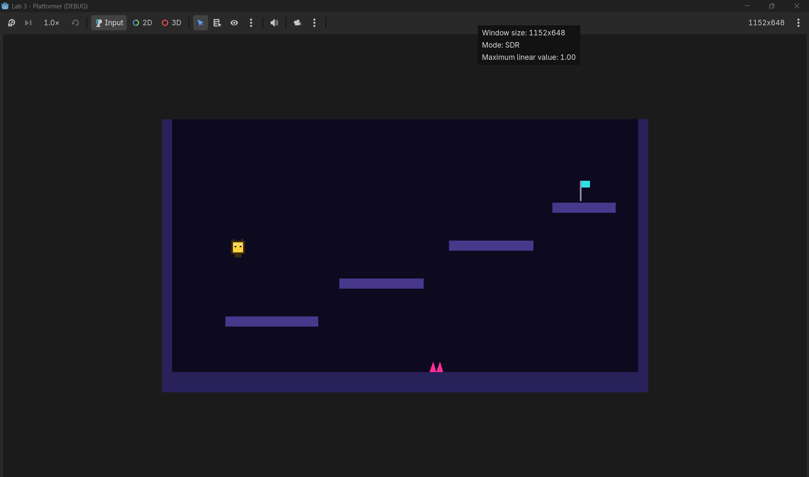

# Lab 3: Platformer

Your third complete game, built solo: a Bearcat who runs, jumps, dies on
spikes, and plants a flag. On the surface it is a platformer. Underneath it is
the real subject of this lab: a **state machine**, the pattern that keeps a
player controller from collapsing into a pile of `if` statements.

Lab 2 hired the physics engine. Lab 3 gives your player a **brain with rooms
in it**: the Bearcat is always in exactly one state (idle, running, airborne),
each state owns its own rules, and changing state happens in exactly one
place. Every controller you build after this (including our four rivals in
Pac-Blitz) is this lab again, with more rooms.

## Getting started

1. Accept the assignment link (posted on Canvas), then clone **your** repo:

   ```bash
   git clone <your-repo-url>
   ```

2. Open `project.godot` in Godot (standard build). Run the project. A floor,
   two walls, and four floating platforms climbing to the right is correct.
   Nobody is there to jump on them yet.
3. Open **`GUIDE.md`** (in this repo) and build milestone by milestone.

## What is already here

- `level.tscn`, a prebuilt `StaticBody2D` with the floor, side walls, and
  four platforms (you built walls in class; the level geometry you get for
  free so you can spend the lab on the brain)
- `assets/player-idle.png`, `assets/player-run.png`, `assets/player-jump.png`
  (one Bearcat, three poses: your states will wear them)
- `assets/spike.png` (touch it and respawn) and `assets/flag.png` (the goal)
- `main.tscn`, with the level already instanced, set as the main scene
- This README and `GUIDE.md`

Everything else you build yourself.

## Requirements

Your submitted game must have, at minimum:

1. A **player** controlled through **custom input actions** (`move_left`,
   `move_right`, `jump`), pulled down by **gravity**, who can only jump from
   the floor.
2. A player brain that is an **explicit state machine**: an enum of at least
   three states (idle, run, and airborne at minimum), a `match` that gives
   each state its own rules, and **state changes routed through one
   function**. Adding a new state must not require rewriting the old ones.
3. **Visible states**: the sprite changes with the state (the three provided
   poses, or your own).
4. A world that **pushes back**: at least one hazard that respawns the player,
   a goal that ends the level, and falling off the bottom respawns too.
5. **Named collision layers** (`world`, `player`, `hazards`, `goal`) with each
   scene's layer and mask set on purpose, plus a short **layer map** in this
   README (who notices whom, and why).
6. At least **one custom feature** you chose and built (see the "Make it
   yours" menu at the end of `GUIDE.md`). Name it in **Your Submission**.
7. Class code style: typed variables, `@export` for tunables, and motion on
   the physics clock.

The guide shows one way to build the core. Deviate freely as long as the
requirements are met.

## How to submit

**Pushing to `main` is the submission.** Commit and push at every milestone:

```bash
git add -A
git commit -m "M2: the brain transplant"
git push
```

Push early, push often. A half-finished game that is pushed beats a finished
game that is not.

## Useful keys

Run Project: **F5** (**Cmd+B** on Mac) · Run Current Scene: **F6** (**Cmd+R**) · Stop: **F8** (**Cmd+.**)

---

## Your Submission

*Fill this section in before the deadline. It is part of the grade.*

**Screenshot of your game:**



**My states:**

> [Idle, Run, and Air. That were the three from class and felt that was needed.]

**My custom feature(s):**

> [I made it so that the player could double jump]

**My layer map:**

> [World, Player, Hazards, Goal. The world is always touchable. The thing that player has to collide. The player comes after because it touches layers below. Hazards and Goals have to be interacted with.]

**One thing that surprised me:**

> [I probably could have added marionberries to spawn on the platform and make a ghost sprite chase me]
